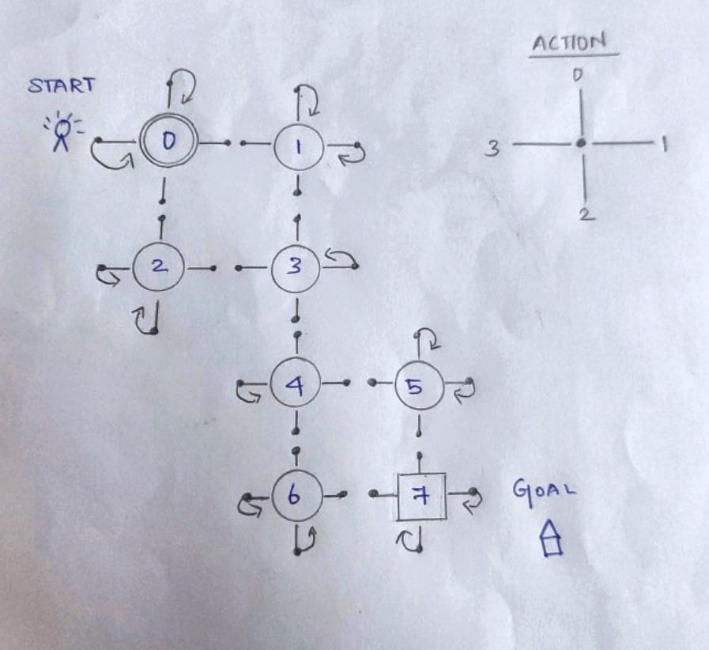
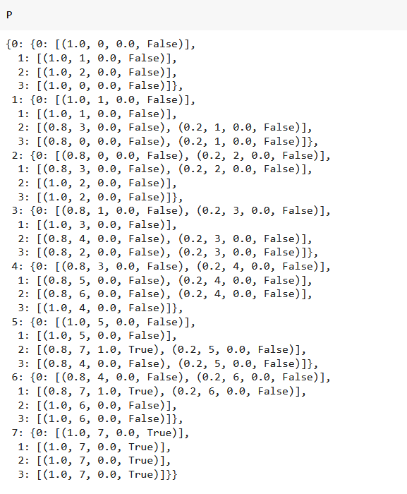

# MDP REPRESENTATION

## AIM:
To represent a Markov Decision Process(MDP) problem in the following ways.

  *  Text representation
  *  Graphical representation
  *  Python - Dictonary representation


## PROBLEM STATEMENT:

### Problem Description

To develop an environment consisting of a mobile tower as the start and the house as the goal. The aim is to make sure the network signals reaches the house.
### State Space
{0,1,2,3,4,5,6,7}

### Sample State
4

### Action Space

* {0} Moving Up
* {1} Moving Right
*  {2} Moving Down
* {3} Moving Left

### Sample Action
{1} Moving Right

### Reward Function

   * +1 - If the goal is reached
   * 0 - Otherwise


### Graphical Representation


## PYTHON REPRESENTATION:
```
P = {
    0 : {
        0 : [(1.0, 0, 0.0, False)],
        1 : [(1.0, 1, 0.0, False)],
        2 : [(1.0, 2, 0.0, False)],
        3 : [(1.0, 0, 0.0, False)]
    },

    1 : {
        0 : [(1.0, 1, 0.0, False)],
        1 : [(1.0, 1, 0.0, False)],
        2 : [(0.8, 3, 0.0, False), (0.2, 1, 0.0, False)],
        3 : [(0.8, 0, 0.0, False), (0.2, 1, 0.0, False)]
    },

    2 : {
        0 : [(0.8, 0, 0.0, False), (0.2, 2, 0.0, False)],
        1 : [(0.8, 3, 0.0, False), (0.2, 2, 0.0, False)],
        2 : [(1.0, 2, 0.0, False)],
        3 : [(1.0, 2, 0.0, False)]
    },

    3 : {
        0 : [(0.8, 1, 0.0, False), (0.2, 3, 0.0, False)],
        1 : [(1.0, 3, 0.0, False)],
        2 : [(0.8, 4, 0.0, False), (0.2, 3, 0.0, False)],
        3 : [(0.8, 2, 0.0, False), (0.2, 3, 0.0, False)]
    },

    4 : {
        0 : [(0.8, 3, 0.0, False), (0.2, 4, 0.0, False)],
        1 : [(0.8, 5, 0.0, False), (0.2, 4, 0.0, False)],
        2 : [(0.8, 6, 0.0, False), (0.2, 4, 0.0, False)],
        3 : [(1.0, 4, 0.0, False)]
    },

    5 : {
        0 : [(1.0, 5, 0.0, False)],
        1 : [(1.0, 5, 0.0, False)],
        2 : [(0.8, 7, 1.0, True), (0.2, 5, 0.0, False)],
        3 : [(0.8, 4, 0.0, False), (0.2, 5, 0.0, False)]
    },

    6 : {
        0 : [(0.8, 4, 0.0, False), (0.2, 6, 0.0, False)],
        1 : [(0.8, 7, 1.0, True), (0.2, 6, 0.0, False)],
        2 : [(1.0, 6, 0.0, False)],
        3 : [(1.0, 6, 0.0, False)]
    },

    7 : {
        0 : [(1.0, 7, 0.0, True)],
        1 : [(1.0, 7, 0.0, True)],
        2 : [(1.0, 7, 0.0, True)],
        3 : [(1.0, 7, 0.0, True)]
    }
}

P
```

## OUTPUT:

## RESULT:
Thus a real world problem is represented as Markov Decision Problem in the following ways successfully: Text Representation, Graphical Representation, Python Representation

